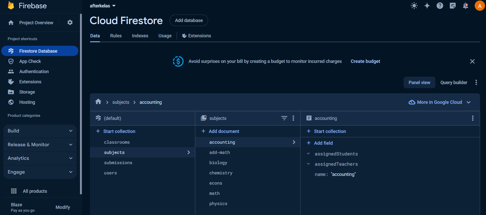

### Afterkelas - Online Tutoring Platform

This is a web application built with Next.js that allows teachers and students to input their details into a system. The application also displays a list of teachers and students who have entered their information.This project is built on top of this repo: https://github.com/ChuksJoshuaa/teacher-student-management

## Features

- Input and display teacher details
- Input and display student details
- Validation for required fields and age restrictions
- Styling using Tailwind CSS
- Caching/Mocking of data
- Unit tests for components validation

## Prerequisites

- Node.js (version 16.20.0)
- npm (version 8.19.4)

## Technologies Used

- React.js
- Tailwind CSS
- JavaScript
- Firebase
- Typescript
- Next.js


## Setup Instructions

### 1. Fork and Clone the Repository

- Fork the repository on GitHub by clicking the "Fork" button.
- Copy the HTTPS link of your forked repository.

### 2. Clone the Repository Locally

1. Open Visual Studio Code (VS Code).
2. In VS Code, go to Source Control (`Ctrl + Shift + G`).
3. If you haven't installed git, please do so from [git-scm.com/](https://git-scm.com/downloads)
4. Click on "Clone Repository".
5. Paste the copied repository link and choose a local directory to clone the project into.

### 3. Install Node.js and Required Dependencies

1. Ensure you have Node.js installed on your system. You can download it from [nodejs.org](https://nodejs.org/).
2. Open a terminal in VS Code or any terminal of your choice.
3. Navigate to the project directory.
4. Run the following command on the terminal (you can use keyboard shortcut `ctrl + ~ `to access it) to install project dependencies:

```bash
npm install
```

### 4. Run the Project Locally
1. After installing dependencies, run the development server:
```bash
npm run dev
```

2. Open a web browser and navigate to localhost:3000 to view the project.

### 5. Setting Up Firebase
1.If you don't have a Firebase account, create one at firebase.google.com. 
2. Go to the Firebase console and create a new project named "Afterkelas" with default settings.
3. In the Firebase console, set up Firestore:
Add collections and documents as shown below:



4. Enable Email/Password authentication in Firebase Auth.

### 6. Configure Firebase Environment Variables
1. In the project's root directory in VS Code, create a new file named .env.local.
2. Copy and paste the following into .env.local, replacing placeholders with your Firebase project settings (you can see this by going to you firebase project console, project overview>project settings>General. You should see code that look something like this
```javascript
const firebaseConfig = {
  apiKey: YOUR_API_KEY,
  authDomain: YOUR_AUTH_DOMAIN,
  ....
};

```
):
```
// .env.local
NEXT_PUBLIC_FIREBASE_API_KEY=YOUR_API_KEY
NEXT_PUBLIC_FIREBASE_AUTH_DOMAIN=YOUR_AUTH_DOMAIN
NEXT_PUBLIC_FIREBASE_PROJECT_ID=YOUR_PROJECT_ID
NEXT_PUBLIC_FIREBASE_STORAGE_BUCKET=YOUR_STORAGE_BUCKET
NEXT_PUBLIC_FIREBASE_MESSAGING_SENDER_ID=YOUR_MESSAGING_SENDER_ID
NEXT_PUBLIC_FIREBASE_APP_ID=YOUR_APP_ID
NEXT_PUBLIC_FIREBASE_MEASUREMENT_ID=YOUR_MEASUREMENT_ID

```

### 7. Connect Firebase to the Project
1. Replace the placeholders in the .env.local file with your actual Firebase project settings.
2. Save the changes.
3. Refresh localhost:3000 in your web browser to view the updated project with Firebase integration.

## Usage

1. Start the application:
```bash
npm run dev
```

2. Open your web browser and navigate to http://localhost:3000.

3. Use the application to see changes you made in code reflected on the browser. If no changes is applied when you edit the code, make sure autosave is turned on in VS Code. You can do this by going to top left and click on File, and make sure there's a click next to the Autosave text, if not click on it and the tick will appear.

## API Usage

No API is implemented yet

## Contributing

Contributions are welcome! If you would like to contribute to this project, please follow these steps:

1. Fork the repository.
2. Create a new branch:
```bash
git checkout -b feature/your-feature-name

```
3. Make your changes and commit them:
```bash
git commit -m 'Add some feature'

```
4. Push to the branch
```bash
git push origin feature/your-feature-name
```

5. Submit a pull request.
